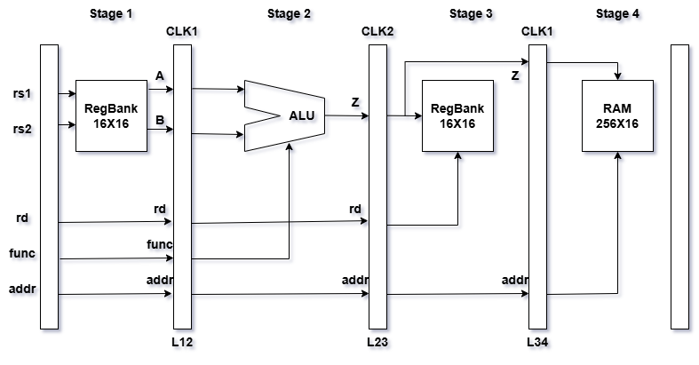
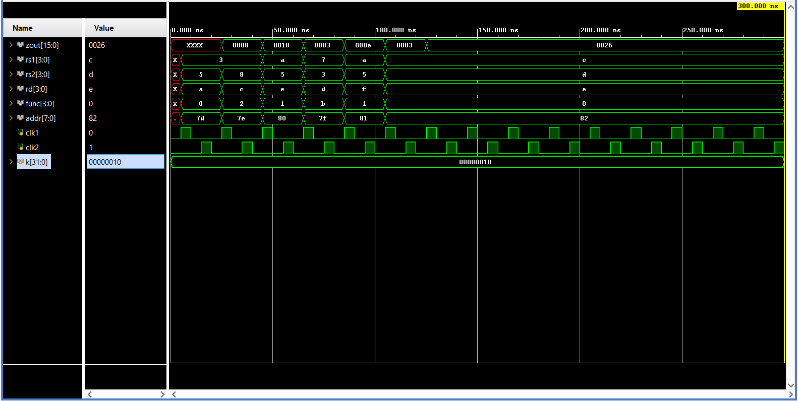

# 4-Stage Pipelined ALU in Verilog

## Overview
This project implements a pipelined 16-bit Arithmetic Logic Unit (ALU) using Verilog HDL. The design performs arithmetic and logical operations on operands read from a register file and processes them through multiple pipeline stages separated by registers.
The pipeline improves throughput by allowing a new instruction to enter the pipeline every clock cycle after the initial latency.
The ALU supports multiple arithmetic, logical, and shift operations and also generates status flags such as carry, overflow, zero, and negative/sign.

## Instruction Format
The pipeline accepts 24-bit instructions in the following format: 
| rs1     | rs2     | rsd     | func    | mem_addr|
|---------|---------|---------|---------|---------|
| 4 bits  | 4 bits  | 4 bits  | 4 bits  | 8 bits  |

## Pipeline Architecture
The ALU is divided into the following four stages:

### Stage 1 – Input Fetch
- Reads two 16-bit operands from the registers specified by `rs1` and `rs2`
- Stores operands in latches **A** and **B**
- Propagates destination register (`rd`), function (`func`), and memory address
  to latches **L12** for the next stage

### Stage 2 – Execute
- Performs the ALU operation on operands **A** and **B** as specified by `func`
- Stores the result in latch **Z**
- Status flags are stored in the flag register.
- Propagates destination register and memory address to latches **L23** for the next stage

### Stage 3 – Write Back
- Writes the value of **Z** to the register specified by destination `rd`
- Propagates the value of **Z** for memory write operation

### Stage 4 – Memory Write
- Stores the result **Z** into the memory location specified by `addr`

## Features
- 4-stage pipelined architecture for faster computations
- Supports **11 arithmetic and logical operations**
- Fully synthesizable Modular implementation with separate ALU, register file, and memory modules
- Status flag generation (carry, overflow, zero, negative)
- Active-low reset for proper initialization
- Fully synchronous, clock-driven design
- Comprehensive testbench for functional verification

## Opcode Definition
The following table lists the supported operations and their corresponding opcode
values specified by the input `func`.

| Opcode (Binary) | Operation | Category   |
|-----------------|-----------|------------|
| 0000            | ADD       | Arithmetic |
| 0001            | SUB       | Arithmetic |
| 0010            | MUL       | Arithmetic |
| 0011            | SELA      | Logical    |
| 0100            | SELB      | Logical    |
| 0101            | AND       | Logical    |
| 0110            | OR        | Logical    |
| 0111            | XOR       | Logical    |
| 1000            | NEGA      | Arithmetic |
| 1001            | NEGB      | Arithmetic |
| 1010            | SRA       | Logical    |
| 1011            | SLA       | Logical    |

## Block Diagram

## Simulation Results

